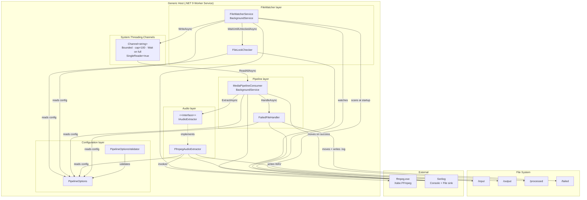
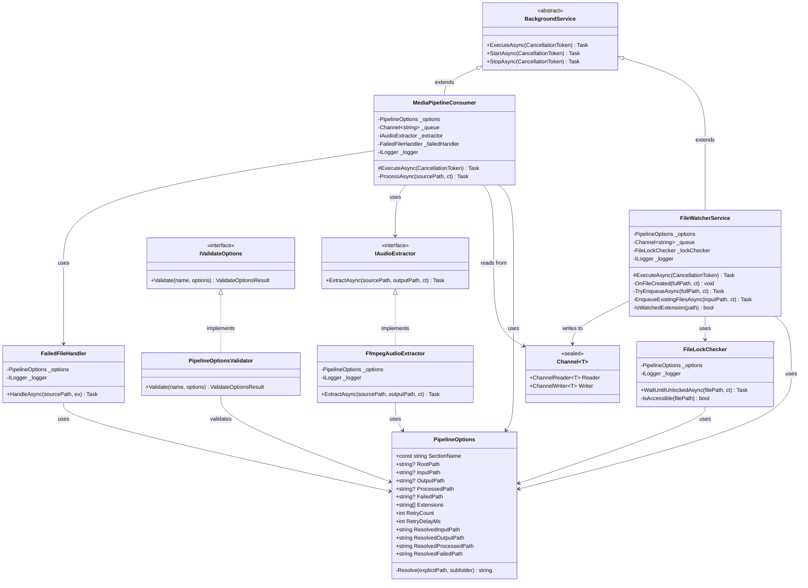
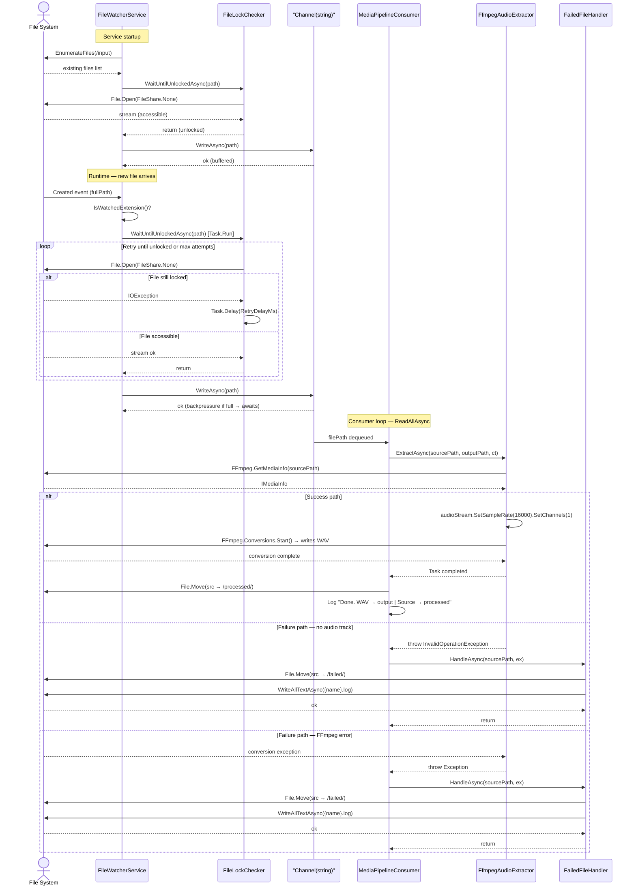
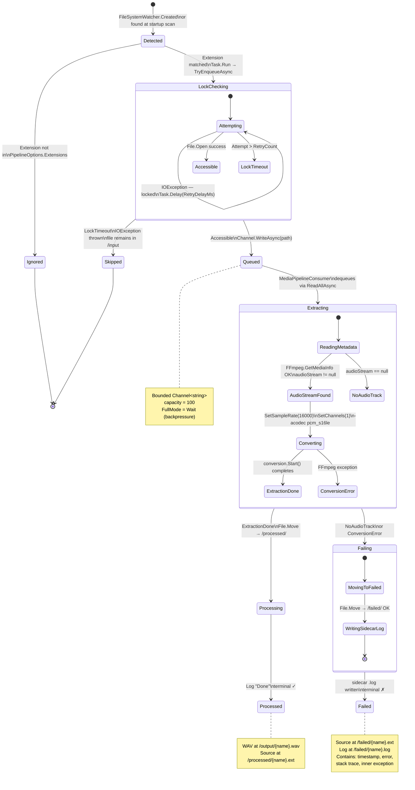

# AudioExtractor — Architecture Documentation

AudioExtractor is a .NET 9 Windows Background Service that monitors a directory for multimedia files, extracts their audio track using FFmpeg, and produces WAV files optimized for transcription (16 kHz, Mono, PCM 16-bit). The service runs headlessly under the Generic Host and is designed to be installed as a Windows Service.

---

## Table of Contents

1. [High-Level Architecture](#1-high-level-architecture)
2. [Class Diagram](#2-class-diagram)
3. [Pipeline Flow](#3-pipeline-flow)
4. [Sequence Diagram](#4-sequence-diagram)
5. [File State Machine](#5-file-state-machine)
6. [Design Decisions](#6-design-decisions)

---

## 1. High-Level Architecture

The system is organized into four cohesive layers. `FileWatcher` produces file paths into a bounded `Channel<string>`. `Pipeline` consumes them, delegates audio extraction to the `Audio` layer, and delegates error handling to `FailedFileHandler`. The `Configuration` layer is a cross-cutting concern consumed by every component via the Options Pattern.

---

## 2. Class Diagram

All classes, interfaces, inheritance chains, and dependency relationships. Constructor-injected dependencies are shown as associations. `BackgroundService` is the .NET base class for hosted background workers.

---

## 3. Pipeline Flow

The complete file lifecycle from filesystem detection to a terminal state (success or failure). The diagram covers both the producer side (detection, extension filter, lock check, enqueue) and the consumer side (extraction, success path, and the two failure paths).

```mermaid
flowchart TD
    START(["Service starts"])
    SERILOG["Bootstrap Serilog"]
    FFMPEG["Verify / download FFmpeg binaries"]
    DI["Register services in DI container"]
    VAL["ValidateOnStart — PipelineOptions"]
    DIRS["EnsureDirectories\ninput · output · processed · failed"]
    SCAN["Scan existing files in /input"]
    WATCH["Start FileSystemWatcher\nNotifyFilter: FileName + LastWrite\nIncludeSubdirectories: false"]

    START --> SERILOG --> FFMPEG --> DI --> VAL --> DIRS --> SCAN --> WATCH

    subgraph PRODUCER["FileWatcherService (Producer)"]
        EVENT["Created event fires\nOnFileCreated(fullPath)"]
        EXTCHK{"IsWatchedExtension?\ncase-insensitive"}
        IGNORED["Log.Debug: Ignored\n(unsupported extension)"]
        TASKRUN["Task.Run — fire-and-forget\nTryEnqueueAsync()"]
        LOCKLOOP{"File.Open\nFileShare.None\nattempt ≤ RetryCount"}
        LOCKWAIT["Task.Delay(RetryDelayMs)\nLog.Warning: locked"]
        LOCKFAIL["IOException thrown\nLog.Error: Skipped"]
        WRITE["Channel.WriteAsync(fullPath)\nbackpressure if full → await"]
        ENQUEUED["Log.Information: Enqueued"]
    end

    subgraph CHANNEL["Channel&lt;string&gt; — Bounded · cap=100 · Wait"]
        BUFFER[["File path buffer"]]
    end

    subgraph CONSUMER["MediaPipelineConsumer (Consumer)"]
        READALL["await foreach\nChannel.ReadAllAsync()"]
        CALCOUT["Compute outputPath\n/output/{name}.wav"]
        EXTRACT["FfmpegAudioExtractor.ExtractAsync()\nFFmpeg.GetMediaInfo()"]
        AUDIOCHECK{"AudioStream\nexists?"}
        NOAUDIO["throw InvalidOperationException\nNo audio track"]
        CONVERT["Set 16000 Hz · 1 ch\n-acodec pcm_s16le\nFFmpeg.Conversions.Start()"]
        SUCCESS{"Extraction\nsucceeded?"}
        MOVEPRO["File.Move → /processed/\noverwrite: true"]
        LOGDONE["Log.Information: Done\nWAV → output | Source → processed"]
        MOVEFAIL["FailedFileHandler.HandleAsync()"]
        MOVEFAILED["File.Move → /failed/\noverwrite: true"]
        WRITELOG["WriteAllTextAsync\n{name}.log\nTimestamp · Source · Error · StackTrace"]
    end

    WATCH --> EVENT
    SCAN --> EXTCHK
    EVENT --> EXTCHK
    EXTCHK -->|"No"| IGNORED
    EXTCHK -->|"Yes"| TASKRUN
    TASKRUN --> LOCKLOOP
    LOCKLOOP -->|"accessible"| WRITE
    LOCKLOOP -->|"locked"| LOCKWAIT
    LOCKWAIT --> LOCKLOOP
    LOCKLOOP -->|"max retries exceeded"| LOCKFAIL
    WRITE --> ENQUEUED
    ENQUEUED --> BUFFER
    BUFFER --> READALL
    READALL --> CALCOUT
    CALCOUT --> EXTRACT
    EXTRACT --> AUDIOCHECK
    AUDIOCHECK -->|"null"| NOAUDIO
    NOAUDIO --> MOVEFAIL
    AUDIOCHECK -->|"found"| CONVERT
    CONVERT --> SUCCESS
    SUCCESS -->|"OK"| MOVEPRO
    MOVEPRO --> LOGDONE
    SUCCESS -->|"Exception"| MOVEFAIL
    MOVEFAIL --> MOVEFAILED
    MOVEFAILED --> WRITELOG

    LOGDONE --> TERMINAL_OK(["File in /processed\nWAV in /output"])
    WRITELOG --> TERMINAL_FAIL(["File in /failed\nSidecar .log written"])
    LOCKFAIL --> TERMINAL_SKIP(["File skipped\nstill in /input"])
```

---

## 4. Sequence Diagram

Interaction between components for a file that enters the pipeline and is processed successfully. The alternative block at the bottom shows what happens when extraction fails (no audio track or FFmpeg error).

---

## 5. File State Machine

Every file that enters the pipeline transitions through a defined set of states. Terminal states are `Processed`, `Failed`, and `Skipped`. The diagram reflects the actual code paths in `FileWatcherService`, `FileLockChecker`, `MediaPipelineConsumer`, `FfmpegAudioExtractor`, and `FailedFileHandler`.

---

## 6. Design Decisions

### Producer-Consumer via `Channel<string>`

**Problem:** File detection (I/O-bound, event-driven) and audio extraction (CPU/I/O-bound, slow) have completely different throughput profiles. Coupling them in the same thread would cause the watcher to block during extraction.

**Solution:** `System.Threading.Channels.Channel<string>` decouples producer from consumer. The bounded capacity of 100 with `FullMode.Wait` provides natural backpressure: if extraction falls behind, the producer awaits instead of allocating unbounded memory. `SingleReader = true` is an honest declaration that MediaPipelineConsumer is the sole reader, which allows the channel to skip internal locking on reads.

**Tradeoff:** The queue is in-memory. A process crash between enqueue and `File.Move` to `/processed/` means the file stays in `/input/` and will be reprocessed on the next startup scan — which is acceptable for this use case.

### Observer via `FileSystemWatcher`

**Problem:** Polling `/input/` on a timer is wasteful and introduces latency proportional to the polling interval.

**Solution:** `FileSystemWatcher` subscribes to OS-level filesystem notifications. The `Created` event fires immediately when a new file appears. The `NotifyFilter` is scoped to `FileName | LastWrite` to suppress irrelevant change events (attribute changes, security changes).

**Tradeoff:** `FileSystemWatcher` can drop events under very high file-creation rates or across network shares. The startup scan in `EnqueueExistingFilesAsync` acts as a safety net for files already present when the service starts, but does not recover events lost during runtime. For higher reliability, a periodic reconciliation scan could be added.

### Options Pattern with `ValidateOnStart`

**Problem:** Misconfigured paths would produce a confusing `NullReferenceException` or `DirectoryNotFoundException` at the point of use, far from the configuration source.

**Solution:** `PipelineOptionsValidator` (implementing `IValidateOptions<PipelineOptions>`) runs at host startup. If `RootPath` and any individual path are both absent, the service refuses to start with a descriptive error list. `ValidateOnStart()` in DI registration makes this fail-fast behavior explicit.

**Tradeoff:** Slightly more boilerplate than Data Annotations, but supports multi-error reporting and complex cross-property rules (e.g., `RootPath` vs individual path precedence).

### Fire-and-Forget Lock Check

**Problem:** The `FileSystemWatcher.Created` event handler is synchronous. Awaiting the lock check inside it would block the watcher's internal thread and potentially delay or drop subsequent events.

**Solution:** `OnFileCreated` dispatches `TryEnqueueAsync` via `Task.Run(...)` — fire-and-forget from the event handler's perspective. The async task handles retries and channel writes independently.

**Tradeoff:** Exceptions that escape `TryEnqueueAsync` are caught internally (IOException → log error, OperationCanceledException → silent exit). Unhandled exceptions in fire-and-forget tasks would be swallowed by default in .NET, so all paths must be covered — and they are.

### Sidecar Log for Failed Files

**Problem:** Moving a failed file to `/failed/` tells the operator *what* failed but not *why*.

**Solution:** `FailedFileHandler` writes a `{basename}.log` alongside the failed file containing timestamp, source path, exception type and message, full stack trace, and inner exception if present. Both the file move and the log write are individually guarded with try/catch so a secondary I/O failure does not mask the original error.

### Technology Stack Summary

| Concern | Choice | Rationale |
|---|---|---|
| App hosting | .NET 9 Generic Host | Headless, Windows Service-compatible, DI and config built-in |
| Queue | `Channel<string>` bounded | Async-native, backpressure via `FullMode.Wait`, zero external dependencies |
| Audio extraction | Xabe.FFmpeg + FFmpeg binary | Handles all target formats; auto-download on first run via `FFmpegDownloader` |
| Configuration | `appsettings.json` + `IOptions<T>` | Standard .NET pattern; fail-fast validation at startup |
| Logging | Serilog | Structured logs; daily rolling files; dual sink (console + file) |
