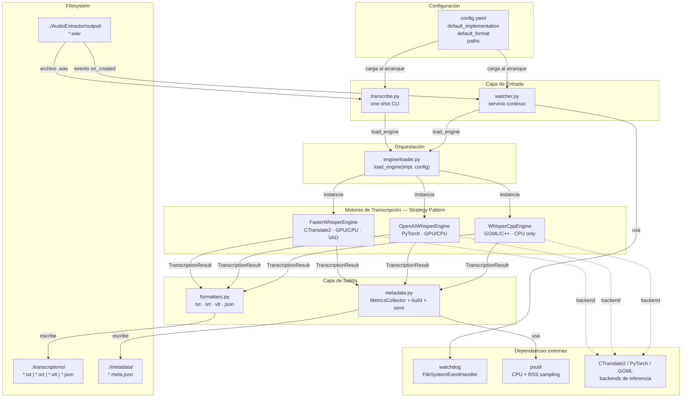
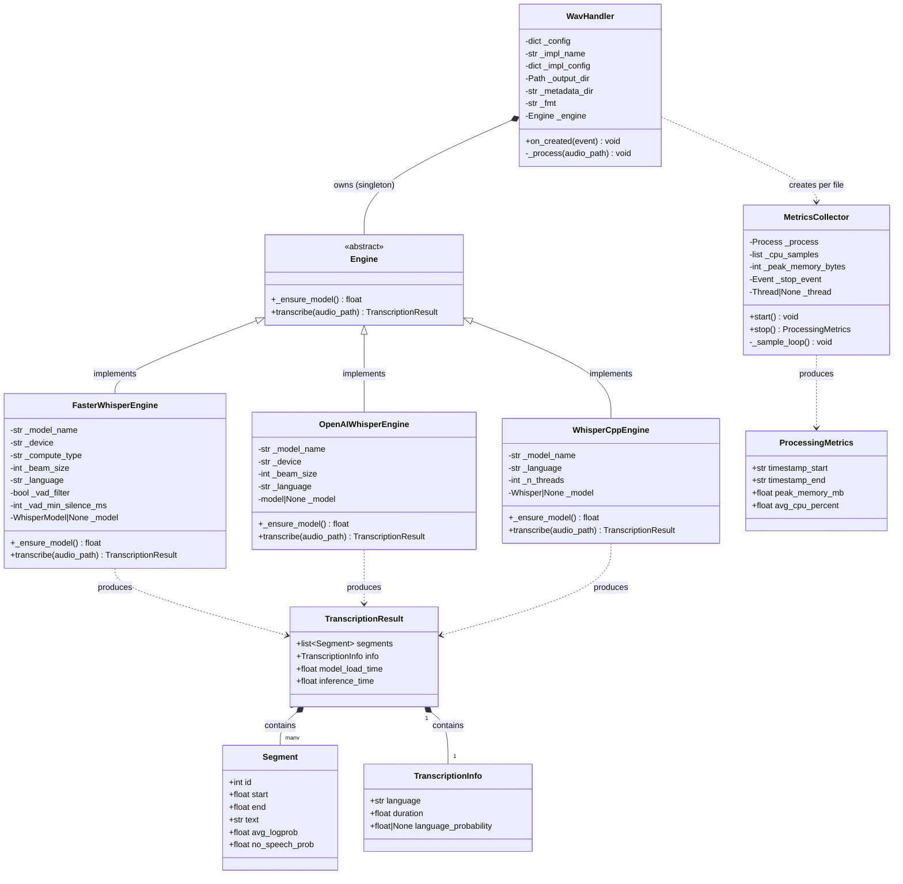
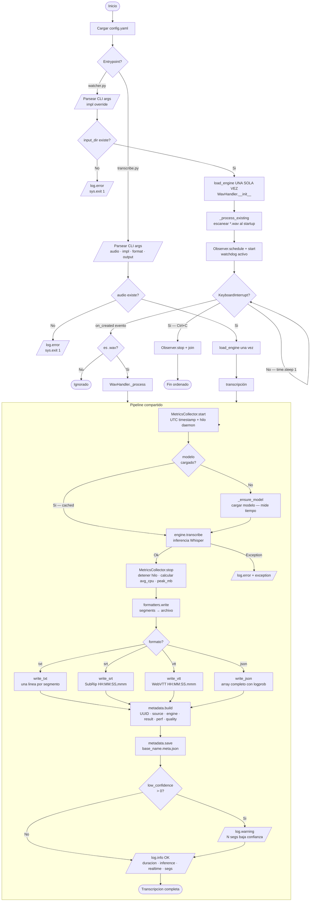
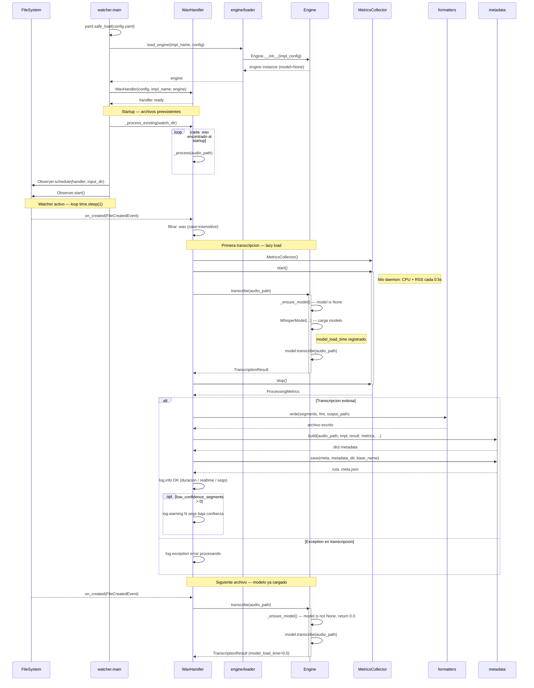
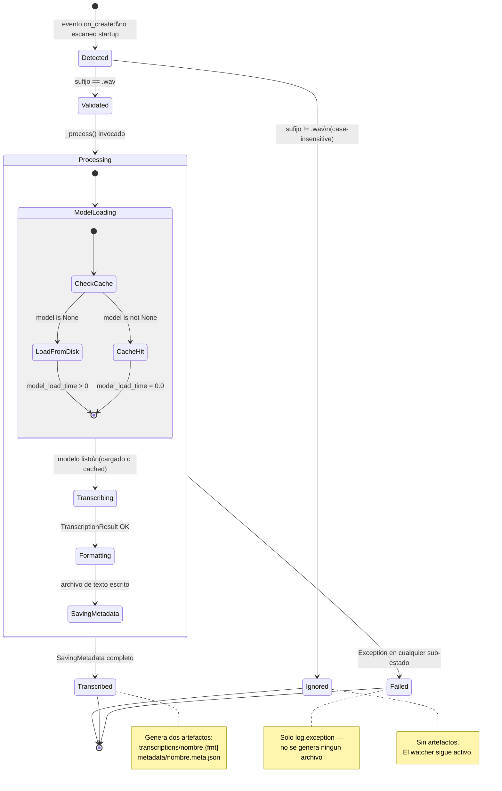
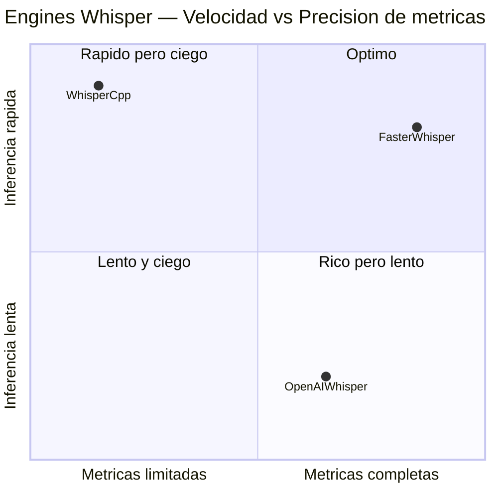
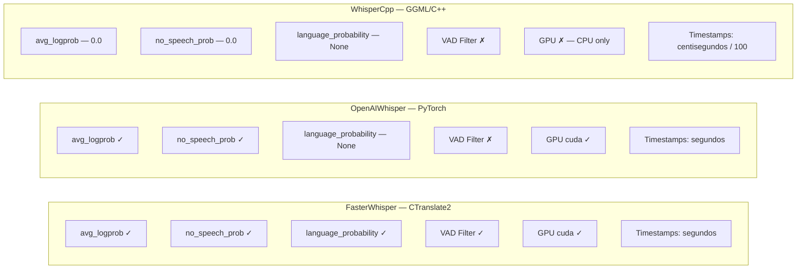

# Transcriber — Arquitectura del Sistema

**Transcriber** es el segundo componente del pipeline `meeting-transcriber`.
Recibe archivos WAV de 16 kHz mono producidos por **AudioExtractor**, los
transcribe usando uno de tres backends Whisper intercambiables, y escribe la
salida en cuatro formatos posibles (TXT, SRT, VTT, JSON) junto con un JSON de
métricas por transcripción.

El sistema expone dos modos de operación independientes:

- **`transcribe.py`** — CLI one-shot para uso interactivo, testing y comparación
  de implementaciones.
- **`watcher.py`** — Servicio continuo event-driven que monitorea el directorio
  de salida de AudioExtractor y transcribe automáticamente cada WAV nuevo.

---

## Tabla de contenidos

1. [Arquitectura de alto nivel](#1-arquitectura-de-alto-nivel)
2. [Diagrama de clases](#2-diagrama-de-clases)
3. [Pipeline completo — flujo de control](#3-pipeline-completo--flujo-de-control)
4. [Secuencia del watcher — happy path](#4-secuencia-del-watcher--happy-path)
5. [Estados del archivo transcrito](#5-estados-del-archivo-transcrito)
6. [Comparación de engines](#6-comparacion-de-engines)
7. [Decisiones de diseño](#7-decisiones-de-diseño)

---

## 1. Arquitectura de alto nivel

El sistema se organiza en cinco capas bien delimitadas. La capa de entrada
contiene los dos entrypoints (`transcribe.py` y `watcher.py`). La capa de
orquestación (`loader.py`) actúa como Factory que resuelve el engine correcto
según configuración. Los tres engines implementan una interfaz uniforme (Strategy
Pattern). La capa de salida separa los formateadores de texto del recolector de
métricas. La configuración centralizada en `config.yaml` fluye hacia todas las
capas en tiempo de arranque.

---

## 2. Diagrama de clases

Muestra la jerarquía completa: las dataclasses del contrato de datos
(`engine/base.py`), los tres engines concretos con su lazy-load interno, la
clase `WavHandler` del watcher, y las dos clases de métricas. Las relaciones de
composición reflejan qué produce qué en tiempo de ejecución.

---

## 3. Pipeline completo — flujo de control

Cubre ambos entrypoints en un solo diagrama. El branching superior separa el
modo CLI del modo watcher. En el watcher, el engine se instancia una sola vez al
startup y el modelo queda en cache en memoria para todas las transcripciones
subsiguientes. Los dos caminos de error (excepción en transcripción y segmentos
de baja confianza) se muestran explícitamente.

---

## 4. Secuencia del watcher — happy path

Muestra el ciclo de vida completo del servicio: startup con procesamiento de
archivos preexistentes, luego el loop de eventos. El lazy model load aparece
diferenciado entre la primera llamada (carga efectiva) y las subsiguientes
(modelo ya en cache). El bloque `alt` cubre el camino de error por excepción.

---

## 5. Estados del archivo transcrito

Cada archivo WAV que entra al sistema atraviesa estos estados. El estado
`Processing` es compuesto: contiene cuatro sub-estados secuenciales que reflejan
las cuatro responsabilidades del pipeline. Los estados terminales `Transcribed`
y `Failed` generan artefactos distintos; `Ignored` no produce ninguno.

---

## 6. Comparacion de engines

Posiciona los tres engines en dos ejes relevantes para la decisión de
implementación: velocidad de inferencia relativa y riqueza de métricas de
calidad disponibles. FasterWhisper domina en ambas dimensiones para CPU; el eje
de precisión de métricas refleja si el engine expone `avg_logprob`,
`no_speech_prob` y `language_probability`.

Detalle de capacidades por engine:

---

## 7. Decisiones de diseño

### Strategy Pattern — engine/

**Problema**: tres backends Whisper con APIs radicalmente distintas
(CTranslate2, PyTorch, GGML/C++), timestamps en unidades diferentes,
disponibilidad de métricas dispar, y necesidad de intercambiarlos sin tocar el
código de orquestación.

**Solución**: cada engine implementa la misma interfaz (`_ensure_model()` +
`transcribe() → TranscriptionResult`). La normalización ocurre dentro de cada
adapter: WhisperCppEngine divide centisegundos por 100, fija `avg_logprob=0.0`
y `no_speech_prob=0.0`, y devuelve `language_probability=None`. El resto del
sistema trabaja siempre con `TranscriptionResult`.

**Tradeoff**: el adapter WhisperCpp pierde información (métricas fijadas en
cero) a cambio de uniformidad. `quality.low_confidence_segments` siempre
reporta 0 con ese backend porque no hay logprob real. Esto está documentado
en config.yaml como limitación conocida.

---

### Factory + Registry — engine/loader.py y formatters.py

**Problema**: necesidad de seleccionar en runtime la clase concreta del engine
(entre tres) y la función de escritura (entre cuatro), sin condicionales
`if/elif` dispersos en el código de orquestación.

**Solución**: `_ENGINE_MAP` y `_WRITERS` son diccionarios que mapean strings a
clases/funciones. `load_engine()` y `write()` hacen un `dict.get()` y levantan
`ValueError` explícito si la clave no existe. Agregar un nuevo engine o formato
requiere solo registrar una entrada en el dict y no tocar nada más.

**Tradeoff**: la validación es en runtime, no en tiempo de import. Un typo en
`config.yaml` falla al arrancar el watcher, no antes. Aceptable porque el error
es claro e inmediato.

---

### Lazy Model Load — _ensure_model()

**Problema**: cargar un modelo Whisper grande (turbo, large-v3) toma entre 5 y
30 segundos dependiendo del hardware. Hacerlo en `__init__` bloquea el arranque
del watcher aunque no haya archivos pendientes. Hacerlo en cada `transcribe()`
destruye el rendimiento en el modo watcher.

**Solución**: el modelo se carga en la primera llamada a `transcribe()` mediante
`_ensure_model()`, que retorna `0.0` si el modelo ya está en memoria. El tiempo
de carga se propaga en `TranscriptionResult.model_load_time` para que los
metadatos lo registren fielmente. En `watcher.py` el engine es un singleton:
todas las transcripciones subsiguientes tienen `model_load_time=0.0`.

**Tradeoff**: la primera transcripción en un watcher recién iniciado tiene
latencia alta. Si el primer archivo llega inmediatamente al startup, el usuario
ve un delay antes del primer log de OK. Para uso interactivo con `transcribe.py`
este costo es inevitable y esperado.

---

### Observer Pattern — watcher.py + watchdog

**Problema**: el servicio necesita reaccionar a archivos nuevos sin polling
activo, respetar el ciclo de vida del proceso (Ctrl+C ordenado), y procesar los
archivos ya presentes al momento de arranque (race condition entre el scan
inicial y el inicio del observer).

**Solución**: `watchdog.Observer` maneja el evento `on_created` via
`WavHandler(FileSystemEventHandler)`. El arranque llama primero a
`_process_existing()` antes de `Observer.start()`, eliminando el race condition:
cualquier archivo presente al inicio se procesa sincrónicamente antes de
activar el listener. `KeyboardInterrupt` dispara `observer.stop()` + `join()`
para shutdown limpio.

**Tradeoff**: `_process_existing()` es bloqueante — el observer no está activo
mientras se procesan los archivos previos. Si hay muchos WAVs al startup, el
servicio no reacciona a nuevos archivos durante ese tiempo. Para el caso de uso
de reuniones (volumen bajo, archivos de minutos de duración) este tradeoff es
aceptable.

---

### Thread-Safe Metrics — MetricsCollector

**Problema**: medir CPU y memoria durante la inferencia requiere muestreo
concurrente — la inferencia bloquea el hilo principal durante segundos o
minutos.

**Solución**: `MetricsCollector` lanza un hilo daemon que usa
`threading.Event.wait(timeout=0.5)` como mecanismo de sleep interrumpible. El
evento `_stop_event` señaliza la terminación sin depender de `Thread.join()`
con timeout arbitrario. El primer sample de `cpu_percent()` es descartado
intencionalmente (psutil siempre retorna `0.0` en la primera llamada).

**Tradeoff**: el hilo daemon muere si el proceso termina abruptamente, pero en
ese caso los metadatos no se escriben de todas formas. La granularidad de 0.5s
da suficiente resolución para transcripciones de más de 10 segundos; para
archivos muy cortos el promedio puede ser de un solo sample.
